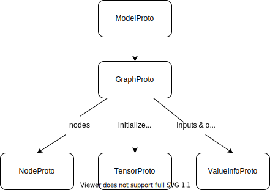

## onnx data structure
https://leimao.github.io/blog/ONNX-Python-API/

| key onnx protos | description |
| --- | --- |
| ModelProto | It contains model description and GraphProto |
| GraphProto | It contains the node information, node initializers, and IO tensors in the model |
| NodeProto | It represents a node in the model. It contains the input and output tensor names, node initializers, and node attributes |
| TensorProto | It represents an node initializer (constant tensor in the node). In addition to the data type and shape, specific values were assigned |
| ValueInfoProto | It represents an IO tensor in the model in which only the data type and shape were defined |

And their relationships are as follows:

## onnx docs
https://onnx.ai/onnx/api/classes.html
