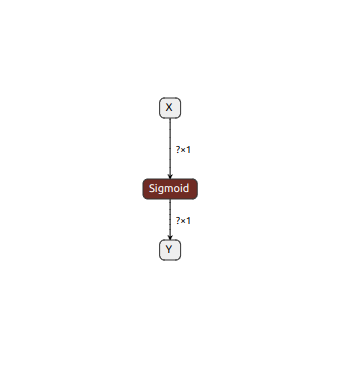
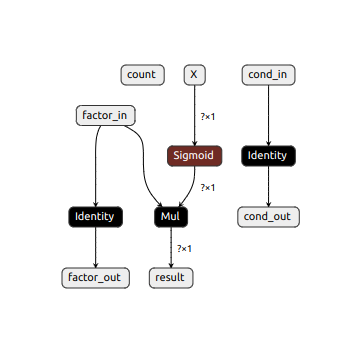

## Run
```bash
python create_sigmoid.py
python modify_sigmoid.py
python run_loop_sigmoid.py
```

## Network structures
`sigmoid.onnx`:



`loop_body.onnx`: for a graph to be used as the body of a loop, it has to have 2+N inputs and 1+N outputs


